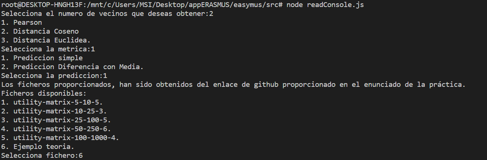
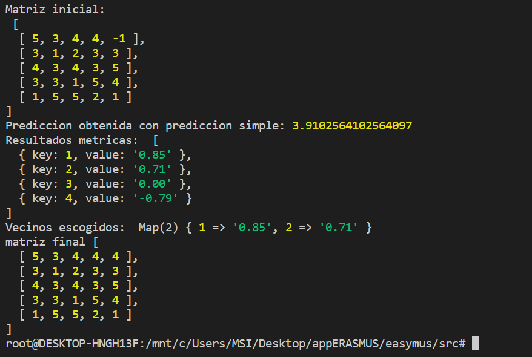
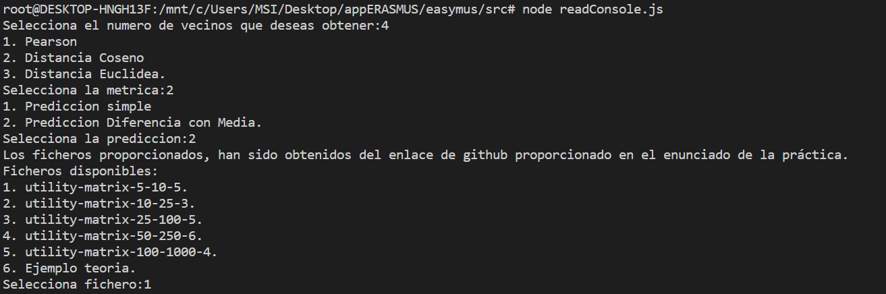
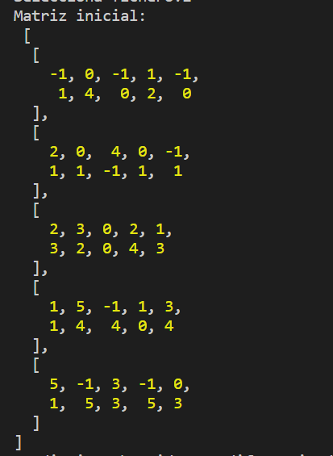
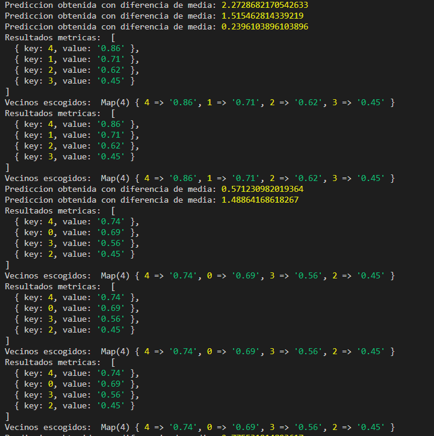
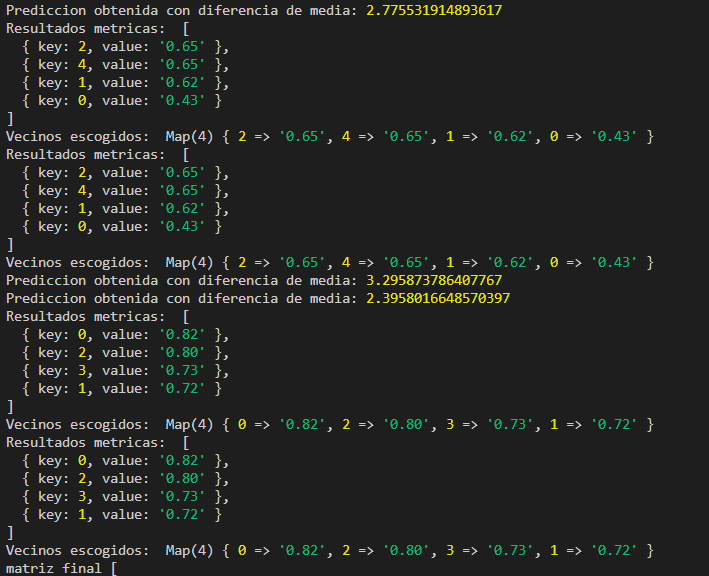
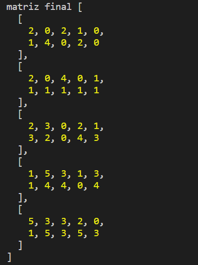

# PRÁCTICA 1 - SISTEMAS DE RECOMENDACIÓN. FILTRADO COLABORATIVO

#### CÓDIGO

El código de la práctica está dividido en los siguientes ficheros:

- readConsole.js: fichero para ejecutar el programa, muestra una serie de opciones por la consola a fin de elegir que métrica, predicción, matriz y número de vecinos se quiere usar. Los ficheros dados fueron sacados de la lista dada en el enlace al repositoria github en el enunciado de la práctica.

- app.js: función principal del programa, se encarga de ir llamando al resto de métodos. Los métodos que contiene son los siguientes:


```js
export default function app(file, n_vecinos, metrica, prediccion) {
    var matriz = readFile(file);
    console.log('Matriz inicial: \n', matriz);
    var i = 0;
    var found = false;

    while (i < matriz.length) {
        for (let j = 0; j < matriz[i].length; j++) {
            if (matriz[i][j] === -1) {
                found = true;
                var resultMetrica = [];
                for (var k = 0; k < matriz.length; k++) {
                    if (i !== k) {
                        var sub_matriz = matrizDosUsuarios(matriz[i], matriz[k]);
                        resultMetrica.push({key: k, value: obtenerMetrica(metrica, sub_matriz)});
                    }
                } 
                var map_vecinos = obtenerVecinos(resultMetrica, metrica, n_vecinos);
                var valoracion = obtenerPrediccion(prediccion, matriz, map_vecinos, j, average(sub_matriz[0]));
                matriz[i][j] = parseInt(valoracion);
            }   
        }

        if (found === false) {
            i++;
        } else found = false;
    }
    console.log('Resultados metricas: ', resultMetrica);
    console.log('Vecinos escogidos: ', map_vecinos);
    console.log('matriz final', matriz);
}
```
Aquí se lee el fichero con la matriz, se recorre la matriz principal, cada fila representa un usuario y cada valor de la fila sus valoraciones, se recorre cada usuario en busca de un item sin valoración representado con '-1', cuando se encuentra se procede a su predicción. Para ello, dentro del último bucle, se calcula primero la similitud entre el usuario escogido y el resto de usuarios, el método 'matrizDosUsuarios()' devuelve una matriz con el usuario principal y con el que se va a comparar en ese momento, de esa forma se hace el calculo con todos los usuarios. El resultado de la métrica se guarda en un vector indicando el usuario (índice en la matriz original) y la similitud obtenida. Cuando se encuentra un '-1' en un usuario, hay que tener en cuenta que puede tener mas items sin valoración, por tanto hay que volver a evaluar ese usuario, para ello se usa la variable booleana. 


```js
function obtenerMetrica(metrica, sub_matriz) {
    switch(metrica) {
        case 'Pearson':
            return Pearson(sub_matriz);
        case 'Distancia Coseno':
            return distanciaCoseno(sub_matriz);
        case 'Distancia Euclidea':
            return distanciaEuclidea(sub_matriz);  
        default:
    }
}
```
Éste método llama al correspondiente para calcular la métrica deseada.


```js
function obtenerVecinos(mapSimilitudes, metrica, n_vecinos) {
    var simSort;
    if (metrica === 'Distancia Euclidea') {
        simSort = mapSimilitudes.sort();
        simSort = simSort.slice(0,n_vecinos);
    } else {
        simSort = mapSimilitudes.sort((a, b) => b.value - a.value);
        simSort = simSort.slice(0,n_vecinos);
    }
    const mapVecinos = new Map(
        simSort.map(object => {
            return [object.key, object.value];
        }),
    );
    return mapVecinos;
}
```
Éste método es para obtener los vecinos deseados para la predicción. Con la lista de similitudes, se ordena de mayor a menor (o al revés, según la metrica usada), para luego escoger los n primeros. 


```js
function obtenerPrediccion(prediccion, matriz, map_vecinos, j, averageU) {
    switch(prediccion) {
        case 'prediccionSimple':
            return prediccionSimple(matriz, map_vecinos, j);
        case 'prediccionDiferenciaMedia':
            return prediccionDiferenciaMedia(matriz, map_vecinos, j, averageU);
        default:
    }
}
```
Éste método llama al correspondiente para calcular la predicción.


- readFile.js: lee el fichero con la matriz y hace los cambios necesarios.

```js
export default function readFile (file) {
  var matrix_return = fs.readFileSync(file, 'utf8', (error, datos) => {
    if (error) throw error;
  });

  var matrix = [];
  matrix_return.split(/\r?\n/).forEach(line => {
    var vector = line.replaceAll("-", "-1").trim().split(" ");
    var vectorInt = [];
    vector.forEach(item => {
      vectorInt.push(Number(item));
    })
    matrix.push(vectorInt);
  });
  return matrix;
}
```
Se pasa el contenido del fichero a una matriz de números, para eso es necesario cambiar los guines de los items sin valorar por, en este caso, un -1. Además se tiene en cuenta que hay que quitar espacios al final de las lineas que pueden alterar el contenido de la matriz.

- metricas.js: métodos con los calculos para cada métrica, se siguió las formulas dadas en las diapositivas de clase.

```js
export function Pearson(matriz) {
    const average_u1 = average(matriz[0]);
    const average_u2 = average(matriz[1]);
    var similitud = 0, numerador = 0, sum_den_a = 0, sum_den_b = 0;

    matriz[0].forEach((valoracion, index) => {
        // numerador
        var prod_a = valoracion - average_u1;
        var prod_b = matriz[1][index] - average_u2;     
        numerador += (prod_a * prod_b);
        // denominador
        sum_den_a += Math.pow(prod_a, 2);
        sum_den_b += Math.pow(prod_b, 2);
    });
    var denominador = Math.sqrt(sum_den_a) * Math.sqrt(sum_den_b);
    similitud = numerador / denominador;
    return similitud.toFixed(2);
}
export function distanciaCoseno(matriz) {
    var user1 = matriz[0]
    var user2 = matriz[1]
    var numerador = 0
    var u1Denominador = 0
    var u2Denominador = 0
    for(let i = 0; i < user1.length; i++) {
        numerador += user1[i] * user2[i]
        u1Denominador += Math.pow(user1[i], 2)
        u2Denominador += Math.pow(user2[i], 2)
    }
    var denominador = (Math.pow(u1Denominador, 0.5).toFixed(3)) * (Math.pow(u2Denominador, 0.5).toFixed(3))
    var sim = numerador / denominador
    return sim.toFixed(2)
}
export function distanciaEuclidea(matriz) {
    var user1 = matriz[0]
    var user2 = matriz[1]
    var sumatorio = 0
    for (let i = 0; i < user1.length; i++) {
        sumatorio += Math.pow(user1[i] - user2[i], 2)
    }
    return Math.sqrt(sumatorio)
}
```

- predicciones.js: métodos con los calculos de las predicciones. se siguió las formulas dadas en las diapositivas de clase.

```js
export function prediccionSimple(matriz, similitudes, i) {
  var denominador = 0, numerador = 0;
  similitudes.forEach((value, key) => {
    numerador += value * matriz[key][i];
  });
  similitudes.forEach((value, key) => {
    denominador += Math.abs(value);
  });
  var result = numerador / denominador;
  console.log('Prediccion obtenida con prediccion simple:', result);
  return result.toFixed(0);
}
export function prediccionDiferenciaMedia(matriz, similitudes, i, averageU) {
    var numerador = 0, denominador = 0;
    similitudes.forEach((value, key) => {
      numerador += value * (matriz[key][i] - average(matriz[key]));
    });
    similitudes.forEach((value, key) => {
      denominador += Math.abs(value);
    });
    var result = averageU + (numerador / denominador);
    console.log('Prediccion obtenida con diferencia de media:', result);
    return result.toFixed(0);
}
```

- operators.js: contiene un método que hace el calculo de la media de un vector.

- arreglosMatriz.js: se le pasa el usuario del que se quiere calcular el item y el usuario con el que se quiere hacer la similitud en ese momento. Este método se encarga de quitar las columnas que no sirven para el calculo, que serían las que contienen valoraciones vacias, y debe quitarse en los dos usuarios para que contengan el mismo número de elementos.

```js
export default function matrizDosUsuarios(usuario1, usuario2) {
    var usu1 = Array.from(usuario1);
    var usu2 = Array.from(usuario2);
    var matriz = [];
    usu1.forEach((item, index) => {
        if (item === -1) {
            usu1.splice(index, 1);
            usu2.splice(index, 1);
        }
    });
    usu2.forEach((item, index) => {
        if (item === -1) {
            usu1.splice(index, 1);
            usu2.splice(index, 1);
        }
    });
    matriz.push(usu1);
    matriz.push(usu2);

    return matriz
}
```


#### EJEMPLOS DE USO

Ejemplo 1:

Este ejemplo se hace con una matriz pequeña para poder observar bien el resultado (matriz de las diapositivas de clase):

5 3 4 4 - 
3 1 2 3 3
4 3 4 3 5
3 3 1 5 4
1 5 5 2 1

El programa se ejecuta con 'node readConsole.js'. Para este ejemplo se escogió lo usado en las diapositivas, 2 vecinos, pearson y predicción simple.



La salida obtenida es:



Lo que se ve es, la matriz original con '-1' en los item sin valoración, el valor de la predicción obtenida a partir de las similitudes que aparecen y cuales concretamente fueron usadas, y la matriz final con la predicción aplicada.

Ejemplo 2:

En este caso se comprueba el calculo de predicción de varios items en una matriz, haciendo uso de la distancia coseno y prediccion diferencia con media.









